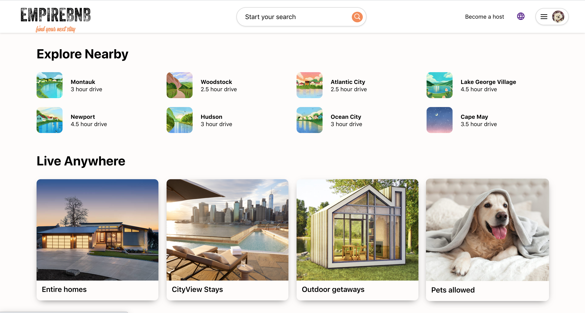
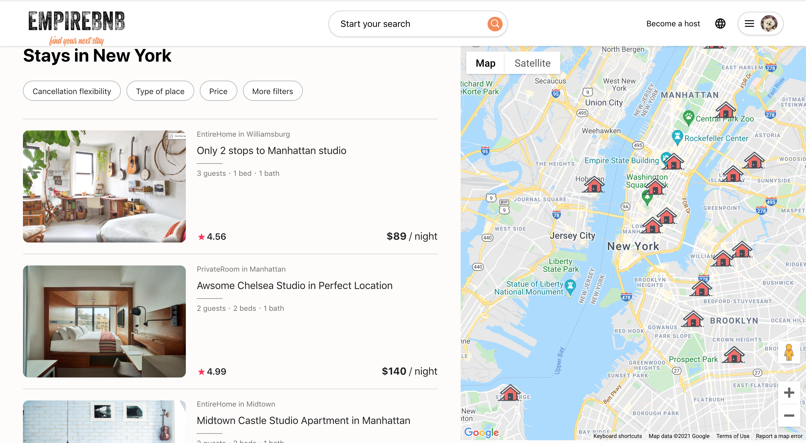
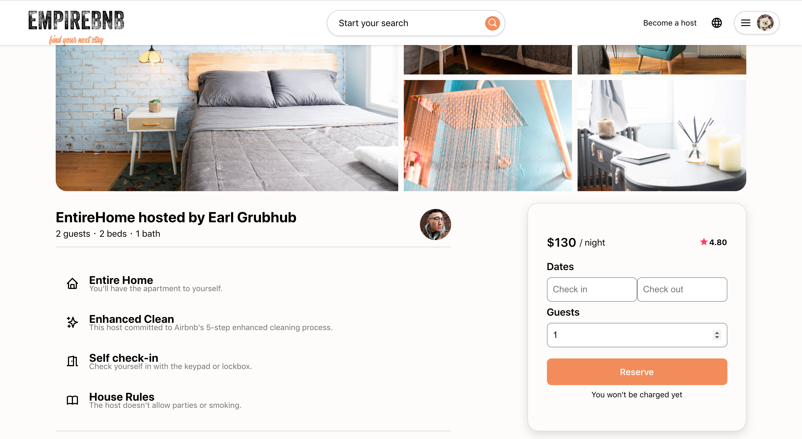
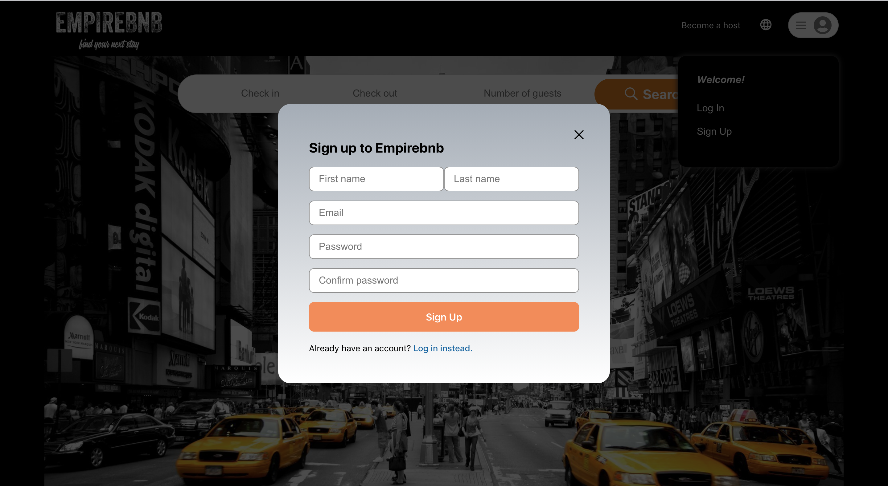
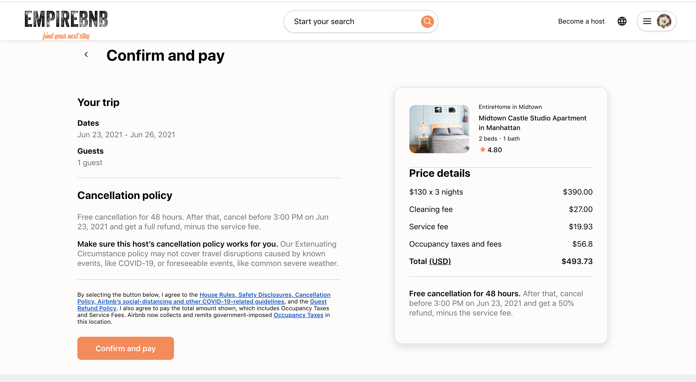
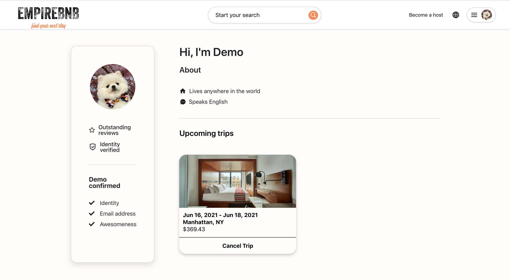
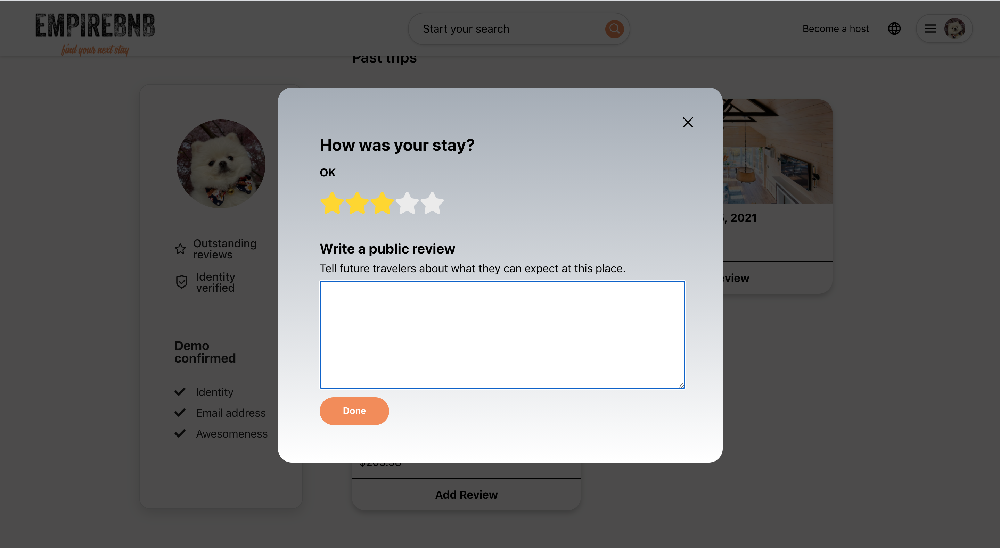

# Welcome to Empirebnb!

### **Live Link: [Empirebnb](https://empirebnb.herokuapp.com/)**

_Empirebnb_, a pixel perfect [Airbnb](https://www.airbnb.com/) clone, is a single page application that allows users to find and rent homes. Users can view browse, create, cancel and review bookings on their profile page.

### Home and About View




### Searching and Booking Page View



### SignUp and Login View


### Confirm Payment and Profile View



### Add review and rating View



## Prerequisites

Before you begin, please check the following Wiki documents:
* [Feature List](https://github.com/QCHEN0407/EmpireBnB/wiki/MVP-Feature-List)
* [Database Schema](https://github.com/QCHEN0407/EmpireBnB/wiki/Database-Schema)
* [API Routes](https://github.com/QCHEN0407/EmpireBnB/wiki/API-Routes)
* [Frontend Routes](https://github.com/QCHEN0407/EmpireBnB/wiki/Frontend-Routes)
* [Wireframe](https://github.com/QCHEN0407/EmpireBnB/wiki/Wire-Frames)

## Technologies used:
#### Backend
* Python
* Flask
* SQLAlchemy
* PostgreSQL
* Docker
* `wtforms`, `wtforms validators`
* `faker` for seed data

#### Frontend
* React.js
* Redux
* JavaScript
* HTML, Vanilla CSS
* Heroku (for hosting services)
* AWS (photo bucket)
* `react-icons`, `date-fns`,`font-awsome`, `nice-date`

### Code Highlights / Challenges

#### Highlights 

* The way to render the upcoming trips and past trips. For past trips, I offer a review function, and for upcoming trips, I offer a cancel option.

```javascript
{past_trips?.bookings.length > 0 ? <h2>Past trips</h2> : <h2>No past trips</h2>}
   <div className="trip_container">
      {past_trips?.bookings.map(booking =>
          <div className="trip_card">
              </img>
              <div className="tripInfo_container">
                  <h4><b>{`${parseDateString(booking.check_in)} - ${parseDateString(booking.check_out)}`}</b></h4>
                  <h3>{`${booking.listing.city}, NY`}</h3>
                  <p>{`$${booking.total_cost}`}</p>
              </div>
              <div className="button_area" onClick={()=>{handleReviewClick(booking.listing.id)}}>
                  <h4>Add Review</h4>
              </div>
          </div>
    </div>
)}
```
* In the review past trips function. I enabled a rating function to apply stars.

```javascript
const radioButtons = () => {
  return [5, 4, 3, 2, 1].map(i => (
    <>
    <input type="radio" key={`radio-${i}`} id={`radio-${i}`} value={i} checked={i === rating}
      onClick={() => setRatingFunc(i)} />
    <label htmlFor={`radio-${i}`} key={`label-${i}`}><i className="fas fa-star fa-2x fa-color"></i></label>
    </>
    )
  )
}
```

```css
.review-rating > label{
    color: #ebebeb;
    padding-top: 20px;
}

input[type="radio"]{
    display: none;
}

input[type="radio"]:checked ~ label {
    color:gold
}

input[type="radio"]:hover ~ label {
    color: gold;
}

.review-rating {
    display: flex;
    flex-direction: row-reverse;
    justify-content: flex-end;
}
```

* In back end responses which need to return details of the listing info, I included the images and reviews info alongside other listing information to the response, which helped the redux store load data for all in one time

```python
def to_dict(self):
     return {
         "id": self.id,
         "title": self.title,
         "description": self.description,
         "type": self.type,
         "host_id": self.host_id,
         "price": self.price,
         "num_guests": self.num_guests,
         "num_beds": self.num_beds,
         "num_baths": self.num_baths,
         "city": self.city,
         "state": self.state,
         "latitude": self.latitude,
         "longitude": self.longitude,
         "rating": str(self.rating),
         "created_at": self.created_at,
         "updated_at": self.updated_at,
         "images": [image.to_dict() for image in self.images],
         "host": self.user.to_dict_simple(),
         "reviews": [review.to_dict() for review in self.reviews]
 }
```

#### Challenges
* Integrating with Google Map API was challenging. They have good support for React but I still need to learn the syntax about how to initialize a map and put markers on them.
* Seeding data was a challenge as well. I needed to find open source data for airbnb listings and parse them into my data model.
* Implementing the booking mechanism needs to interact with different types of data stores and do CRUD operations to the backend.

## Future Implementations 
- Become a Host
- Edit & Delete reviews
- Edit user profile
- More filtered search options
- Messaging Host

## Empirebnb Developer
- [@vivianchen](https://github.com/QCHEN0407) 📹

---
_© 2021 Empirebnb. No rights reserved._
